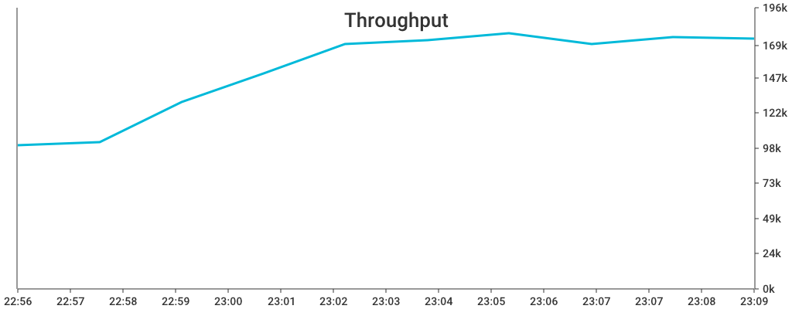

# APM charts
Application performance management (APM) charts

## Usage

```go
f, _ := os.Create("apdex.png")
defer f.Close()

data := []float64{
    1.0,
    0.99,
    0.95,
    0.8,
    1.0,
}
times := []float64{
    1619954810000.0,
    1619954820000.0,
    1619954830000.0,
    1619954840000.0,
    1619954850000.0,
}
options := charts.Options{
    Width: 800,
    Height: 400
    Legend: []string{"Service Apdex"},
    TimeFormat: "15:04",
    ColorPalette: apmcharts.DefaultColorPalette,
    Title: "Service Apdex",
}

apmcharts.RenderApdex(data, times, f, options)
```
### Apdex


### Latency


### Response Time


### Throughput


### Timeseries


### Total Request / Errors

